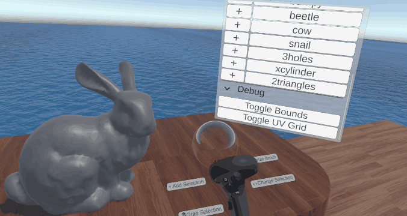

# Gallery & Showcase

This is a bachelor thesis trying to create a VR editor for libigl with Unity. It is meant to work towards a VR equivalent of the 2D libigl viewer. 

## Overview

.. 
.. figure:: /docs/_static/images/simple-deform-usage.*

   **Biharmonic deform** example with **multi-selection** and **two handed transformation**.

.. 
.. figure:: /docs/_static/images/arap-usage.*

   **As-Rigid-As-Possible** deform example. Performs slower than the harmonic, however, causes less distortions and retains more surface details. We can see that the geometry operations are **on a separate thread**.

.. 
.. figure:: /docs/_static/images/multi-object-usage.*

   Support for **multiple meshes**. Context sensitive **input hints** can also be seen on the controller. 

## Deformations

.. 
.. figure:: /docs/_static/images/harmonic-dynamic-selections.*

   Biharmonic deform working with varying number of selections as boundaries

.. 
.. figure:: /docs/_static/images/knight-arap-vs-harmonic.*

   As-rigid-as-possible preserves surface details and volume better in comparison to the biharmonic deformation.

## Editing meshes

.. 
.. figure:: /docs/_static/images/pivot-modes.*

   Different **pivot modes** are available - hand, mesh center, selection center. This can be toggled via UI (seen at the top) or via a button.

.. 
.. figure:: /docs/_static/images/selection-modes.*

   Different modes for **editing the active selection** - add, remove, invert and new/clear selection per stroke.

.. 
.. figure:: /docs/_static/images/transforming-selections.*

   Different ways of selecting **which selection/s should be transformed** based on the bubble brush. When starting a stroke the selection mask inside the brush is used, if empty the active selection mask is used. Only when both hands have the same mask *scaling and two handed rotation* are enabled.

.. 
.. figure:: /docs/_static/images/multi-object-editing.*

   More detailed example of multi-mesh editing. Switching between editing a mesh and transforming the whole mesh (*similar to edit and object mode in Blender*). The holographic shader can also be seen when the active mesh or controllers are occluded.

## Misc

.. 
.. figure:: /docs/_static/images/performance-thread-indicator.*

   **Performance** is still in real-time for large meshes. If a geometry calculation takes too long the **thread indicator** shows, which is quite useful for debugging.

.. 
.. figure:: /docs/_static/images/ui-tooltips.*

   **Tooltips** are shown on the left hand (green box) when hovering over a UI element. **Input hints** are placed on the controller and adapt based on what you are doing. This makes the app much more user-friendly.

.. 
.. figure:: /docs/_static/images/ui-interaction.*

   UI panels can be *grabbed*, the laser is only for interaction with the UI and is hidden otherwise.

.. 
.. figure:: /docs/_static/images/vr-locomotion.*

   Teleporting and snap turn for **locomotion** in VR

.. :: Leave this comment here